# Process: درخواست ماموریت (Business Trip / Mission Request)

- **WFClass:** `BusinessTrip`
- **Context entity:** `BusinessTrip`
- **Display name:** درخواست ماموریت
- **Wizard steps:** [1][2][3][4][5][6][7]
- **استاندارد مرجع:** فرایند ماموریت شرکت‌های صنعتی/معدنی (با مرحله‌ی HSE برای ماموریت سایت/معدن و چرخه‌ی پیش‌پرداخت → گزارش → تسویه)

> این فایل فقط **طراحی** است. وضعیت verify و پیشرفت Wizard در `STATUS.md` نوشته می‌شود.

---

## Step 1 — Model Process

فایل دیاگرام مرجع: [`BusinessTrip.bpmn`](./BusinessTrip.bpmn) (در [demo.bpmn.io](https://demo.bpmn.io/) باز کنید).

### Lanes (نقش‌ها)

| Lane | نقش |
|------|-----|
| `Lane_Employee` | کارمند (متقاضی) |
| `Lane_Manager` | مدیر مستقیم |
| `Lane_HSE` | واحد HSE (ایمنی) |
| `Lane_Admin` | امور اداری |
| `Lane_TicketOfficer` | مسئول تهیه بلیط |
| `Lane_Finance` | امور مالی |

### Task table

| # | tskName (شناسه فنی) | Display name | idTaskType | Lane |
|---|---------------------|--------------|------------|------|
| 1 | `StartMission` | شروع | 1 (Start) | کارمند |
| 2 | `SubmitMission` | ثبت درخواست ماموریت | 2 (Manual) | کارمند |
| 3 | `ManagerApproval` | تایید مدیر مستقیم | 2 (Manual) | مدیر مستقیم |
| 4 | `Gateway_ManagerDecision` | تایید شد؟ | Gateway (XOR) | مدیر مستقیم |
| 5 | `EndRejected` | رد شد | 6 (End) | مدیر مستقیم |
| 6 | `Gateway_FieldMission` | ماموریت سایت/معدن؟ | Gateway (XOR) | HSE |
| 7 | `HSEReview` | بررسی ایمنی و HSE | 2 (Manual) | HSE |
| 8 | `Gateway_FieldMerge` | — (merge) | Gateway (XOR) | HSE |
| 9 | `Gateway_Advance` | پیش‌پرداخت دارد؟ | Gateway (XOR) | امور مالی |
| 10 | `FinanceAdvance` | بررسی و پرداخت پیش‌پرداخت | 2 (Manual) | امور مالی |
| 11 | `Gateway_AdvanceMerge` | — (merge) | Gateway (XOR) | امور مالی |
| 12 | `Gateway_TransportType` | نوع تأمین نقلیه؟ | Gateway (XOR) | امور اداری |
| 13 | `AdminArrangement` | هماهنگی خودرو سازمانی و اقامت | 2 (Manual) | امور اداری |
| 14 | `BookTicket` | تهیه بلیط | 2 (Manual) | مسئول تهیه بلیط |
| 15 | `CancelBooking` | لغو ماموریت (رویداد مرزی روی `BookTicket`) | 12 (Boundary/Message, interrupting) | مسئول تهیه بلیط |
| 16 | `NotifyTicketOfficer` | اطلاع لغو ماموریت به مسئول تهیه بلیط | 2 (Manual) | مسئول تهیه بلیط |
| 17 | `EndCancelled` | ماموریت لغو شد | 6 (End) | مسئول تهیه بلیط |
| 18 | `Gateway_TransportMerge` | — (merge) | Gateway (XOR) | امور اداری |
| 19 | `SubmitReport` | ثبت گزارش و درخواست تسویه | 2 (Manual) | کارمند |
| 20 | `FinanceSettlement` | تسویه حساب مالی | 2 (Manual) | امور مالی |
| 21 | `EndApproved` | پایان (انجام و تسویه شد) | 6 (End) | امور مالی |

### Flow (Mermaid — مرجع متنی)

```mermaid
flowchart LR
    Start([شروع]) --> Submit[ثبت درخواست ماموریت]
    Submit --> Mgr[تایید مدیر مستقیم]
    Mgr --> GwMgr{تایید شد؟}
    GwMgr -- رد --> EndRej([رد شد])
    GwMgr -- تایید --> GwField{ماموریت سایت/معدن؟}
    GwField -- بله --> HSE[بررسی ایمنی و HSE]
    GwField -- خیر --> MField{ }
    HSE --> MField
    MField --> GwAdv{پیش‌پرداخت دارد؟}
    GwAdv -- بله --> Adv[بررسی و پرداخت پیش‌پرداخت]
    GwAdv -- خیر --> MAdv{ }
    Adv --> MAdv
    MAdv --> GwTr{نوع تأمین نقلیه؟}
    GwTr -- سازمانی --> Admin[هماهنگی خودرو سازمانی و اقامت]
    GwTr -- عمومی --> Ticket[تهیه بلیط]
    Ticket -. لغو توسط مدیر/متقاضی .-> Notify[اطلاع لغو به مسئول تهیه بلیط]
    Notify --> EndCxl([ماموریت لغو شد])
    Admin --> MTr{ }
    Ticket --> MTr
    MTr --> Report[ثبت گزارش و درخواست تسویه]
    Report --> Settle[تسویه حساب مالی]
    Settle --> EndOk([انجام و تسویه شد])
```

### قوانین Gateway (روایی — expression در Step 4)

- `Gateway_ManagerDecision`: اگر مدیر تایید نکند → `EndRejected`؛ در غیر این صورت ادامه.
- `Gateway_FieldMission`: اگر ماموریت در سایت/معدن یا منطقه عملیاتی باشد (`isSiteMission = true`) → الزام بررسی HSE؛ وگرنه عبور.
- `Gateway_Advance`: اگر متقاضی پیش‌پرداخت خواسته باشد (`advanceRequested = true`) → مرحله مالی پیش‌پرداخت؛ وگرنه عبور.
- `Gateway_TransportType`: اگر وسیله نقلیه عمومی لازم است (`isPublicTransport = true`) → `BookTicket` (مسئول تهیه بلیط)؛ در غیر این صورت `AdminArrangement` (تأمین خودرو سازمانی).

### لغو ماموریت حین تهیه بلیط (Boundary Event)

- روی task `BookTicket` یک **رویداد مرزی پیام (interrupting)** به نام `CancelBooking` قرار دارد.
- **محرک:** درخواست لغو توسط **مدیر مافوق** یا **درخواست‌دهنده** در بازه‌ای که بلیط در حال تهیه است (`cancellationRequested = true`).
- با وقوع لغو، workitem فعال `BookTicket` متوقف (interrupt) شده و جریان به `NotifyTicketOfficer` می‌رود تا **مسئول تهیه بلیط** از لغو مطلع شود (مثلاً برای استرداد/کنسلی بلیط)، سپس `EndCancelled`.
- **پیاده‌سازی در Studio:** اقدام «لغو ماموریت» را به‌صورت یک action/notification در اختیار مدیر و متقاضی قرار دهید که فلگ `cancellationRequested` را ست و رویداد را raise کند. اطلاع‌رسانی به مسئول تهیه بلیط را می‌توان به‌صورت ایمیل خودکار + task تایید رویت پیاده کرد.

---

## Step 2 — Model Data

**Context entity:** `BusinessTrip` (فرایندی / Process entity)

موجودیت‌های پارامتری (Parameter entities) برای لیست‌های کشویی:

| Entity | کاربرد | مقادیر نمونه |
|--------|--------|---------------|
| `MissionType` | نوع ماموریت | درون‌شهری، برون‌شهری، خارج از کشور |
| `TransportMode` | وسیله نقلیه | خودرو سازمانی، خودرو شخصی، اتوبوس، قطار، هواپیما |

### Attributes — `BusinessTrip`

| attribName | Display name | نوع Studio | توضیح |
|------------|--------------|-----------|-------|
| `requestNumber` | شماره درخواست | String | شماره/کد درخواست |
| `requestDate` | تاریخ ثبت | Date-time | پیش‌فرض: تاریخ جاری |
| `requester` | متقاضی | Related (WFUSER) | کاربر ثبت‌کننده |
| `personnelCode` | کد پرسنلی | String | |
| `department` | واحد سازمانی | String | (یا Related به Area) |
| `positions` | سمت | String | `position` کلمه کلیدی رزروشده بیزاجی است → از `positions` استفاده شد |
| `missionType` | نوع ماموریت | Related (`MissionType`) | |
| `missionPurpose` | شرح و هدف ماموریت | Extended Text | |
| `originLocation` | مبدا | String | |
| `destination` | مقصد | String | |
| `startDateTime` | تاریخ و ساعت شروع | Date-time | |
| `endDateTime` | تاریخ و ساعت پایان | Date-time | |
| `durationDays` | مدت (روز) | Integer | محاسبه‌شده (Step 4) |
| `isPublicTransport` | نیاز به وسیله نقلیه عمومی | Boolean (yes-no) | true = عمومی (تهیه بلیط) · false = سازمانی (خودرو). محرک `Gateway_TransportType` |
| `transportMode` | وسیله نقلیه | Related (`TransportMode`) | |
| `isSiteMission` | ماموریت سایت/معدن | Boolean (yes-no) | محرک مرحله HSE |
| `needsAccommodation` | نیاز به اقامت | Boolean (yes-no) | |
| `estimatedCost` | برآورد هزینه | Integer | ریال |
| `advanceRequested` | درخواست پیش‌پرداخت | Boolean (yes-no) | محرک مرحله مالی |
| `advanceAmount` | مبلغ پیش‌پرداخت درخواستی | Integer | ریال |
| `managerApproved` | تایید مدیر | Boolean (yes-no) | تصمیم gateway مدیر |
| `managerComment` | نظر مدیر | Extended Text | |
| `hseApproved` | تایید HSE | Boolean (yes-no) | |
| `requiresSafetyTraining` | نیاز به آموزش ایمنی | Boolean (yes-no) | |
| `hseRequirements` | الزامات ایمنی | Extended Text | |
| `advancePaidAmount` | مبلغ پرداخت‌شده | Integer | ریال |
| `advancePaymentDate` | تاریخ پرداخت پیش‌پرداخت | Date-time | |
| `assignedVehicle` | خودرو تخصیص‌یافته | String | |
| `driverName` | نام راننده | String | |
| `accommodationDetails` | جزئیات اقامت | Extended Text | |
| `ticketDetails` | جزئیات بلیط (شماره/شرکت/پرواز) | Extended Text | برای حالت عمومی |
| `ticketCost` | هزینه بلیط | Integer | ریال |
| `cancellationRequested` | درخواست لغو ماموریت | Boolean (yes-no) | محرک رویداد مرزی `CancelBooking` |
| `cancelledBy` | لغوکننده | Related (WFUSER) | مدیر مافوق یا متقاضی |
| `cancelReason` | علت لغو | Extended Text | |
| `cancellationDate` | تاریخ لغو | Date-time | |
| `missionReport` | گزارش ماموریت | Extended Text | |
| `actualCost` | هزینه واقعی | Integer | ریال |
| `settlementAmount` | مبلغ تسویه (مابه‌التفاوت) | Integer | محاسبه‌شده (Step 4) |
| `settlementApproved` | تایید تسویه | Boolean (yes-no) | |
| `attachments` | پیوست‌ها (فاکتور/بلیط) | File | |

> توجه: انواع نوع Studio مطابق Studio 11.x — Date-time (نه Date)، String (نه Text)، Boolean (yes-no). مقادیر مالی Integer در نظر گرفته شد؛ در صورت نیاز به اعشار، نوع را در Studio به Decimal/Float تغییر دهید.

---

## Step 3 — Define Forms

یک فرم برای هر task انسانی. ستون «وضعیت فیلد» قابلیت ویرایش را نشان می‌دهد.

### Form: `SubmitMission` (کارمند)

| فیلد (xpath) | برچسب | وضعیت |
|--------------|-------|-------|
| `BusinessTrip.requestNumber` | شماره درخواست | read-only (auto) |
| `BusinessTrip.requestDate` | تاریخ ثبت | read-only |
| `BusinessTrip.requester` | متقاضی | read-only |
| `BusinessTrip.personnelCode` | کد پرسنلی | editable |
| `BusinessTrip.department` | واحد سازمانی | editable |
| `BusinessTrip.positions` | سمت | editable |
| `BusinessTrip.missionType` | نوع ماموریت | editable (required) |
| `BusinessTrip.missionPurpose` | شرح و هدف ماموریت | editable (required) |
| `BusinessTrip.originLocation` | مبدا | editable (required) |
| `BusinessTrip.destination` | مقصد | editable (required) |
| `BusinessTrip.startDateTime` | شروع | editable (required) |
| `BusinessTrip.endDateTime` | پایان | editable (required) |
| `BusinessTrip.isPublicTransport` | نیاز به وسیله نقلیه عمومی؟ (عمومی/سازمانی) | editable (required) |
| `BusinessTrip.transportMode` | وسیله نقلیه | editable (required) |
| `BusinessTrip.isSiteMission` | ماموریت سایت/معدن | editable |
| `BusinessTrip.needsAccommodation` | نیاز به اقامت | editable |
| `BusinessTrip.estimatedCost` | برآورد هزینه | editable |
| `BusinessTrip.advanceRequested` | درخواست پیش‌پرداخت | editable |
| `BusinessTrip.advanceAmount` | مبلغ پیش‌پرداخت | editable (visible if `advanceRequested = true`) |

### Form: `ManagerApproval` (مدیر مستقیم)

| فیلد | برچسب | وضعیت |
|------|-------|-------|
| همه فیلدهای درخواست | اطلاعات ماموریت | read-only |
| `BusinessTrip.managerApproved` | تایید/رد | editable (required) |
| `BusinessTrip.managerComment` | نظر مدیر | editable |

### Form: `HSEReview` (HSE)

| فیلد | برچسب | وضعیت |
|------|-------|-------|
| اطلاعات ماموریت + مقصد | — | read-only |
| `BusinessTrip.hseApproved` | تایید HSE | editable (required) |
| `BusinessTrip.requiresSafetyTraining` | نیاز به آموزش ایمنی | editable |
| `BusinessTrip.hseRequirements` | الزامات ایمنی | editable |

### Form: `FinanceAdvance` (مالی)

| فیلد | برچسب | وضعیت |
|------|-------|-------|
| `BusinessTrip.advanceAmount` | پیش‌پرداخت درخواستی | read-only |
| `BusinessTrip.advancePaidAmount` | مبلغ پرداخت‌شده | editable (required) |
| `BusinessTrip.advancePaymentDate` | تاریخ پرداخت | editable (required) |

### Form: `AdminArrangement` (امور اداری — مسیر سازمانی)

| فیلد | برچسب | وضعیت |
|------|-------|-------|
| `BusinessTrip.transportMode` | وسیله نقلیه | read-only |
| `BusinessTrip.needsAccommodation` | نیاز به اقامت | read-only |
| `BusinessTrip.assignedVehicle` | خودرو تخصیص‌یافته | editable |
| `BusinessTrip.driverName` | نام راننده | editable |
| `BusinessTrip.accommodationDetails` | جزئیات اقامت | editable (visible if `needsAccommodation = true`) |

### Form: `BookTicket` (مسئول تهیه بلیط — مسیر عمومی)

| فیلد | برچسب | وضعیت |
|------|-------|-------|
| مقصد/مبدا/تاریخ‌ها/نوع نقلیه | اطلاعات سفر | read-only |
| `BusinessTrip.ticketDetails` | جزئیات بلیط (شماره/شرکت/پرواز) | editable (required) |
| `BusinessTrip.ticketCost` | هزینه بلیط | editable |

### Form: `NotifyTicketOfficer` (مسئول تهیه بلیط — اطلاع لغو)

| فیلد | برچسب | وضعیت |
|------|-------|-------|
| `BusinessTrip.cancelledBy` | لغو توسط | read-only |
| `BusinessTrip.cancellationDate` | تاریخ لغو | read-only |
| `BusinessTrip.cancelReason` | علت لغو | read-only |
| `BusinessTrip.ticketDetails` | بلیط ثبت‌شده (برای استرداد) | read-only |

> این فرم صرفاً جهت **اطلاع و تایید رویت** مسئول تهیه بلیط است تا در صورت تهیه بلیط، اقدام استرداد/کنسلی انجام دهد.

### Form: `SubmitReport` (کارمند)

| فیلد | برچسب | وضعیت |
|------|-------|-------|
| اطلاعات ماموریت | — | read-only |
| `BusinessTrip.missionReport` | گزارش ماموریت | editable (required) |
| `BusinessTrip.actualCost` | هزینه واقعی | editable (required) |
| `BusinessTrip.attachments` | پیوست فاکتور/بلیط | editable |

### Form: `FinanceSettlement` (مالی)

| فیلد | برچسب | وضعیت |
|------|-------|-------|
| `BusinessTrip.advancePaidAmount` | پیش‌پرداخت | read-only |
| `BusinessTrip.actualCost` | هزینه واقعی | read-only |
| `BusinessTrip.settlementAmount` | مبلغ تسویه | read-only (calculated) |
| `BusinessTrip.settlementApproved` | تایید تسویه | editable (required) |

> فرم‌ها به Step 2 وابسته‌اند. هر تغییر فرم → bump `formsVersion` → Publish.

---

## Step 4 — Business Rules

### شرایط Transition (Gateway)

| Gateway | مسیر | Expression (XPath کامل) |
|---------|------|--------------------------|
| `Gateway_ManagerDecision` | رد → `EndRejected` | `BusinessTrip.managerApproved = false` |
| `Gateway_ManagerDecision` | تایید (else/default) | `BusinessTrip.managerApproved = true` |
| `Gateway_FieldMission` | بله → `HSEReview` | `BusinessTrip.isSiteMission = true` |
| `Gateway_FieldMission` | خیر (default) | `BusinessTrip.isSiteMission = false` |
| `Gateway_Advance` | بله → `FinanceAdvance` | `BusinessTrip.advanceRequested = true` |
| `Gateway_Advance` | خیر (default) | `BusinessTrip.advanceRequested = false` |
| `Gateway_TransportType` | عمومی → `BookTicket` | `BusinessTrip.isPublicTransport = true` |
| `Gateway_TransportType` | سازمانی (default) → `AdminArrangement` | `BusinessTrip.isPublicTransport = false` |

### رویداد مرزی لغو (`CancelBooking` روی `BookTicket`)

- نوع: رویداد مرزی پیام، **interrupting** (`cancelActivity = true`).
- محرک: ست شدن `cancellationRequested = true` توسط مدیر مافوق یا متقاضی حین فعال بودن `BookTicket`.
- مسیر: `CancelBooking` → `NotifyTicketOfficer` → `EndCancelled`.
- هنگام لغو: `cancelledBy`, `cancelReason`, `cancellationDate` ثبت شوند (در action لغو).

### Default / Calculated

| محل | قانون |
|-----|------|
| `requestDate` | پیش‌فرض = `DateTime.Now` هنگام ساخت case |
| `durationDays` | محاسبه = اختلاف روز بین `endDateTime` و `startDateTime` (+1) |
| `settlementAmount` | محاسبه = `actualCost − advancePaidAmount` (مثبت = پرداخت به کارمند، منفی = بازگشت به شرکت) |

### Validation

| فرم | قانون |
|-----|------|
| `SubmitMission` | `endDateTime >= startDateTime`؛ اگر `advanceRequested = true` آنگاه `advanceAmount > 0` |
| `SubmitReport` | `actualCost >= 0` و `missionReport` غیرخالی |

> `guidRule` را در Studio ویرایش کنید، نه در SQL.

---

## Step 5 — Performers

| Task | Performer (نقش) |
|------|------------------|
| `SubmitMission` | متقاضی (case creator) |
| `ManagerApproval` | مدیر مستقیمِ متقاضی (Manager relation در org) |
| `HSEReview` | عضو واحد HSE / مسئول ایمنی |
| `FinanceAdvance` | کارشناس امور مالی |
| `AdminArrangement` | کارشناس امور اداری / پشتیبانی |
| `BookTicket` | مسئول تهیه بلیط |
| `NotifyTicketOfficer` | مسئول تهیه بلیط (همان متصدی بلیط) |
| `SubmitReport` | همان متقاضی |
| `FinanceSettlement` | کارشناس امور مالی |

> نقش‌ها بر اساس مدل سازمانی پروژه تنظیم شوند. اگر ساختار org هنوز publish نشده، قبل از Step 5 با کاربر تایید شود (نقش حدس زده نشود).

---

## Step 6 — Integrate

| مورد | وضعیت |
|------|-------|
| ایمیل اطلاع‌رسانی | اختیاری — اعلان به متقاضی هنگام رد/تایید نهایی و پرداخت پیش‌پرداخت |
| **اعلان لغو به مسئول تهیه بلیط** | لازم — ایمیل/نوتیفیکیشن خودکار هنگام لغو ماموریت (`CancelBooking`) برای اقدام استرداد بلیط |
| اتصال به سیستم حقوق و دستمزد / حسابداری | N/A در نسخه اول (دستی) — در صورت نیاز connector در فاز بعد |
| محاسبه فوق‌العاده ماموریت (per diem) | N/A در نسخه اول — قابل افزودن به‌صورت rule/connector |

---

## Step 7 — Execute

### چک‌لیست Publish

1. Step 1: نام‌گذاری همه taskها/gatewayها/eventها مطابق جدول (بدون `Activity_1`/`Gateway_1`).
2. Step 2: ساخت entity `BusinessTrip` + پارامترها + attributeها.
3. Step 3: فرم هر task.
4. Step 4: شرط gatewayها + calculated + validation.
5. Step 5: performer هر activity.
6. Publish Process.
7. اجرای `VERIFY.sql` و به‌روزرسانی `STATUS.md`.

### Test cases

| سناریو | ورودی | انتظار |
|--------|-------|--------|
| TC1 — مسیر کامل سایت + پیش‌پرداخت + نقلیه عمومی | `isSiteMission=true`, `advanceRequested=true`, `isPublicTransport=true`, مدیر تایید | عبور از HSE و FinanceAdvance؛ رسیدن به `BookTicket`؛ پایان `EndApproved` |
| TC2 — ماموریت اداری، خودرو سازمانی، بدون پیش‌پرداخت | `isSiteMission=false`, `advanceRequested=false`, `isPublicTransport=false`, مدیر تایید | عبور مستقیم؛ مسیر `AdminArrangement`؛ پایان `EndApproved` |
| TC3 — رد مدیر | `managerApproved=false` | خاتمه در `EndRejected` |
| TC4 — لغو حین تهیه بلیط | `isPublicTransport=true`؛ هنگام فعال بودن `BookTicket` → `cancellationRequested=true` توسط مدیر/متقاضی | توقف `BookTicket`، فعال شدن `NotifyTicketOfficer`، خاتمه در `EndCancelled` |
